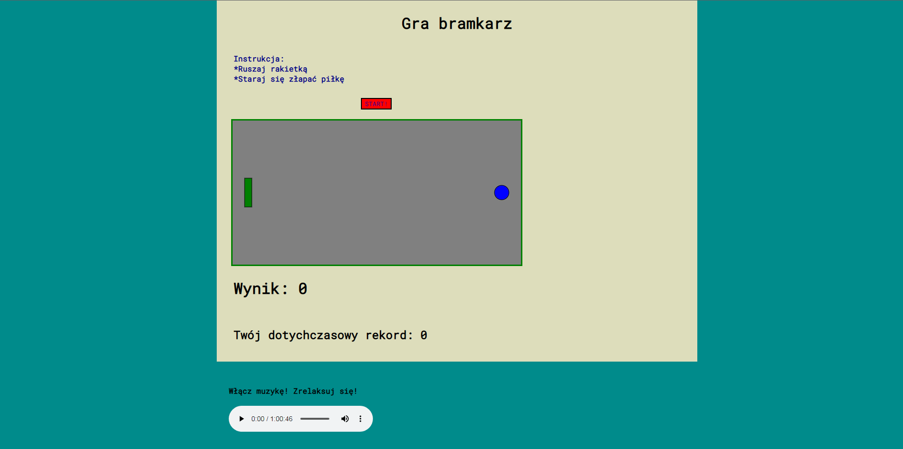

# Ball catcher 

This is a website where the game "Ball catcher" is located.

## Install and open
Clone the repository and open the "index.html" file to open the website with the game.

## Features and options
- game
- showing the current score
- showing your best score
- listening to the music which the website provides

## Game instruction
Move the racket with the up and down arrows on the keyboard and try to catch the ball. The higher the score, the faster the ball moves.

## Stack
HTML, CSS, JavaScript

## Preview screenshot

